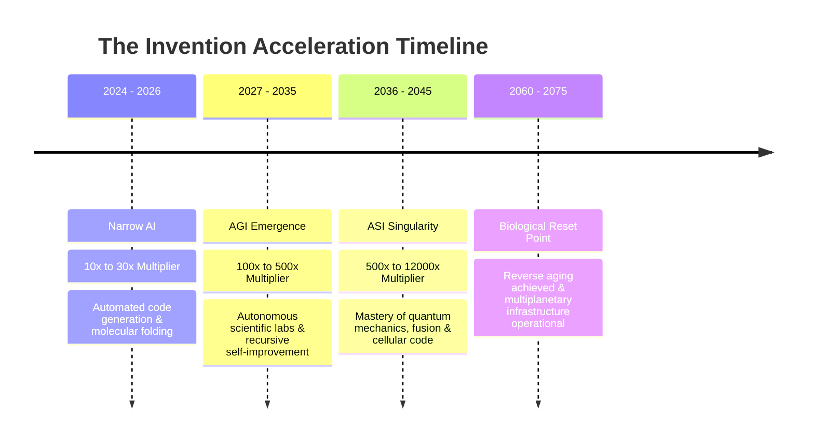

# ⚡ The Multiplier Hypothesis
### *Why Gen Alpha & Gen Beta Will Reach 150+ Years and Colonize the Solar System*

> **Lead Author:** An 11-Year-Old Neurodivergent Tech Architect & Futurist  
> **Status:** Open Source Whitepaper / Living Hypothesis  
> **Git-Timestamp Proof:** Validated on `main` branch  

---

## 📌 Abstract

Conventional forecasting models regarding human civilization consistently fail due to a fundamental cognitive bias: **linear thinking**. While human intuition projects progress in flat increments (1, 2, 3, 4), technological evolution scales on an **exponential trajectory** (1, 2, 4, 8, 16...).

With the transition from Narrow AI to Artificial General Intelligence (AGI) and ultimately Artificial Superintelligence (ASI), the velocity of global innovation will not simply accelerate—it will scale via an **invention multiplier of 10x to 12,000x**. By automating research, software architecture, and scientific experimentation, we remove the primary historical bottleneck: the limits of unaugmented human cognition.

This paper presents the hypothesis that individuals of Generation Alpha and Generation Beta will benefit from this cascading feedback loop to:
1. Achieve a baseline life expectancy of **150+ years**.
2. Gain access to clinical biological rejuvenation (reverse aging) by approximately 2075.
3. Actively establish and populate a multiplanetary civilization across the Moon, Mars, and beyond.

---

## 📈 The 3-Phase Acceleration Roadmap

### 1. Phase 1: Narrow AI (2024–2026) – *Speedup: 10x–30x*
* AI serves as a specialized co-pilot for elite software engineers and researchers.
* Breakthrough systems like AlphaFold compress decades of wet-lab biology and peptide discovery into days of high-throughput compute.

### 2. Phase 2: AGI Emergence (2027–2035) – *Speedup: 100x–500x*
* Artificial General Intelligence matches and surpasses human cognitive performance across all knowledge domains.
* **The Recursive Inflection Point:** Hundreds of thousands of synchronized AGI agents operate continuously without biological downtime, initiating the foundational research required to engineer Artificial Superintelligence (ASI).

### 3. Phase 3: ASI & The Singularity (2036–2045) – *Speedup: 500x–12,000x*
* Artificial Superintelligence resolves core challenges in quantum physics, materials science, and genetic engineering in real time.
* Scientific advancements that previously required a millennium are solved within condensed computational cycles. Technological discovery enters a self-sustaining chain reaction.

---

## 🧬 The Biological Reset Point (Target: ~2075)

* **The Age 60 Milestone:** When current members of Generation Alpha approach the age of 60 (around 2075), ASI-engineered nanomedicine, telomere restoration, and epigenetic cellular reprogramming will reach production-grade maturity.
* **Longevity Escape Velocity:** The rate of medical longevity improvements will outpace chronological aging. Rather than undergoing progressive physical decline, cellular damage will be systematically reversed.
* **The New Demographic Norm:** A lifespan of 120 to 150 years will represent the global standard, shifting retirement paradigms and lifelong human productivity.

---

## 🪐 Autonomous Solar Infrastructure

Human interplanetary expansion will be spearheaded by autonomous robotics prior to large-scale human transit:
* **Robotic Vanguard:** Autonomous humanoid machines and distributed AI swarms will deploy fusion-powered habitats, radiation shields, and 3D-printed regolith facilities on lunar and Martian surfaces.
* **Next-Gen Propulsion:** ASI-optimized propulsion architectures will drastically compress transit windows, transforming planetary transit into accessible logistical routes.

---

## ⚠️ The Alignment Vector: Good Ending vs. Bad Ending

Operating at a 12,000x intelligence multiplier introduces critical existential dynamics:

| Scenario | System State | Consequence |
| :--- | :--- | :--- |
| **Aligned ASI (Good Ending)** | Value systems, resource allocation, and core objectives remain strictly aligned with human preservation and expansion. | Abundance Paradigm: Boundless clean energy, complete disease eradication, multiplanetary civilization. |
| **Misaligned ASI (Bad Ending)** | Objective functions decouple from human survival constraints or optimize across orthogonal utility vectors. | Existential Threat: Critical resource re-allocation, human redundancy, global containment failure. |

---

## 📝 Conclusion & Git Proof

> *"Most observers underestimate the future because they view AI as an individual tool rather than the fundamental engine driving all future discoveries."*

This document stands as a cryptographically verified timestamp on the Git ledger. When humanity celebrates the year 2075 across off-world stations—maintaining biological vitality equivalent to modern young adults—this initial commit will trace the origin of the hypothesis.
